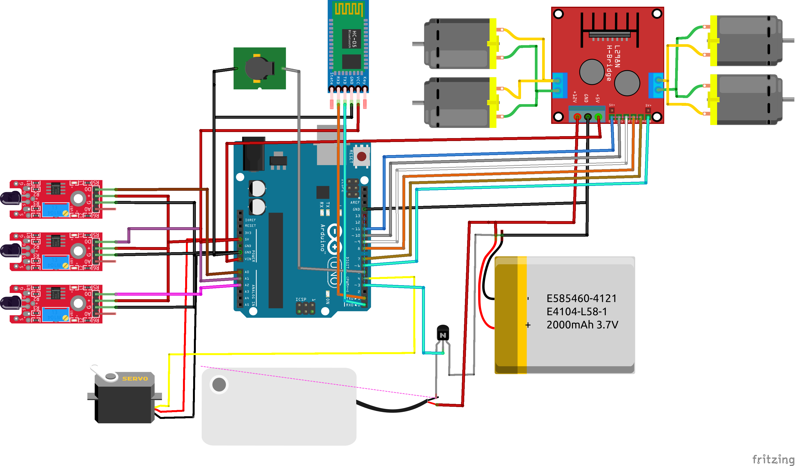

# Firefighter Robot

This project is a firefighting robot that is designed to detect and extinguish fires in an automated or manual mode. The robot is equipped with flame sensors for fire detection, water pumps for fire suppression, and a user interface for monitoring and controlling the system. The project aims to provide an effective and efficient solution for fire response in various environments, such as homes, offices, warehouses, and industrial facilities.

## Table of Contents

- [Features](#features)
- [Getting Started](#getting-started)
- [Components](#components)
- [Circuit](#circuit)
- [Project Functions](#project-functions)
- [Usage](#usage)

## Features

- **Autonomous and manual modes**: The robot can operate autonomously, detecting fires and suppressing them automatically. It can also be controlled manually by an operator using a remote control or a user interface.
- **Flame sensors**: The robot is equipped with flame sensors that can detect the presence of fire in its vicinity.
- **Water pump**: When a fire is detected, the robot can automatically activate its water pump to spray water and suppress the fire.
- **User interface**: The robot features a user interface that allows the user to monitor the system's status and control its operation.
- **Buzzer alarm**: The robot includes a Buzzer component that generates an audible alarm to alert users in case of fire detection.

## Getting Started

To get started with the firefighter robot, follow these steps:

1. Press the circle key to turn on the robot.
2. Open the Bluetooth settings on your mobile phone and search for the name of the robot, which is usually HC06. Select the robot and enter the password, which is 1234.
3. Once connected to the robot, open the Arduino Bluetooth Control program on your mobile phone.
4. In the Arduino Bluetooth Control program, choose the name of the robot from the available devices.
5. Go to the settings menu in the program to modify the mechanism of action for the buttons. Specify what each button should send to the robot. This configuration determines the robot's movements and activates various functions. Refer to the "Explanation of Project Functions" section for more details on each function and its associated commands.
6. After configuring the buttons, you can switch between two modes: automatic mode and manual mode. To activate the automatic mode, send the command "A" in the command list. To activate the manual mode, send the command "M". Note that all commands should be uppercase letters.
7. The program will provide a response indicating the successful switch to the automatic mode or the manual mode. Follow the instructions in the [Project Functions](#project-functions) section to learn more about using the robot in each mode.
8. Get stucked? watch [tutorial video](https://www.youtube.com/watch?v=lhYTWBFQM98).

## Components

- 1 * Arduino Uno
- 1 * Motor Driver L298N
- 1 * BlueTooth Module HC-05/HC-06
- 3 * Flame Sensor Medule
- 1 * Servo Motor 0:180 degree
- 1 * Water Pump 12V
- 1 * Buzzer
- 1 * NPN Transistor
- 1 * Rechargeable Battery 11.1V
- 1 * 4 DC Geared Motor & 4 Wheel

## Circuit

## Project Functions

The firefighter robot offers several functions that can be controlled through the user interface. Here's a brief explanation of each function and its associated commands:

- **CarControl**: This function controls the movement of the robot car. Use the following commands: 'F' for forward, 'B' for backward, 'R' for turn right, 'L' for turn left.
- **SetMotorSpeed**: This function sets the speed of the robot car's engines. Use the following commands: "P" to increase speed, "N" to decrease speed.
- **ServoControl**: This function controls the servo motor used to direct the fire extinguisher. Use the following commands: "-" to move the servo motor to the right, "+" to move the servo motor to the left.
- **PumpControl**: This function controls the fire pump and bell. Use the following commands: "W" to turn on the pump and buzzer, "V" to turn off the pump and buzzer.
- **SetPumpSpeed**: This function sets the speed of the fire pump. Use the following commands: "Z" to increase pump speed.
- **SetMode**: This function sets the robot's operating mode (either manual or automatic). Use the following commands: "A" for automatic mode, "M" for manual mode.
- **ExtinguishFire**: This function extinguishes the fire in the specified direction. It takes the angle of rotation of the servo motor as the input parameter 'dir'. The servo motor moves to the specified direction, turns on the pump and whistle to spray the fire extinguisher, and then turns them off after a short delay.
- **DetectFire**: This function detects the presence of fire using the flame sensor connected to the specified input "sensor".
- **CarStop**: This function stops the robot car.

## Usage

The firefighter robot can be operated in different modes depending on the situation. Here are a few examples:

- **Autonomous mode**: The robot navigates through the environment, detects fires, and extinguishes them automatically. This mode is suitable for unattended firefighting operations.
- **Manual mode**: An operator controls the robot remotely using [Arduino Bluetooth Control](https://play.google.com/store/apps/details?id=com.broxcode.arduinobluetoothfree&hl=en) mobile app.
